# Laboratório 02 — Estratégias e Níveis de Teste na Prática

## Domínio escolhido

O domínio escolhido é um sistema fictício de GPS/GNSS para comunicação Terra–Satélite e determinação de posicionamento. Os satélites transmitem sinais de navegação; o receptor coleta sinais de múltiplos satélites, valida seu conteúdo e encaminha observações, informações temporais e dados orbitais para o cálculo da posição. Não há uma requisição de localização feita ao satélite como se ele fosse uma API.

Os números citados nos testes não são especificações oficiais do GPS. Quando aparecem, são valores fictícios adotados exclusivamente para este estudo de caso.

## Arquitetura base do sistema

A arquitetura conceitual é a mesma em todas as abordagens:

- `ConstelacaoGPS` agrega `SateliteGPS`, que transmite sinais de navegação para `ReceptorGPS`.
- `ValidadorSinal` verifica integridade e consistência básica dos sinais recebidos.
- `ProcessadorSinalGPS` extrai observações, marcas de tempo e identificadores orbitais.
- `SincronizadorTempo`, `ServicoEfemerides` e `CalculadoraPosicao` apoiam o cálculo.
- `ServicoEfemerides` consulta `RepositorioDadosOrbitais` e pode usar `CacheEfemerides` em contingência.
- `ServicoPosicionamento` coordena o fluxo e entrega o resultado à `AplicacaoNavegacao`.
- `EstacaoControleTerrestre` monitora a constelação e atualiza os dados orbitais por um controle de acesso.

### Diagrama base

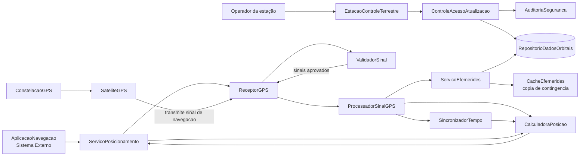

Fontes: [PlantUML](diagramas/plantuml/00-arquitetura-base.puml) · [Mermaid](diagramas/mermaid/00-arquitetura-base.mmd)

## 1. Teste de Unidade

### 1.1 Verificação de lógica atômica em componente/classe isolada

**Explicação:** `CalculadoraPosicao` é testada isoladamente com `ObservacaoSatelite`, `Efemerides` e tempo controlados. O executor fornece observações de quatro satélites e verifica se `calcular()` produz uma `Posicao` coerente.

**Objetivo do teste:** verificar a lógica atômica de combinação das pseudodistâncias, do tempo e das efemérides sem depender de receptor, satélites ou repositório.

**Defeitos que busca revelar:** erros em fórmulas e condicionais, associação incorreta entre satélite e órbita, tratamento indevido de dados incompletos e falhas de fronteira.

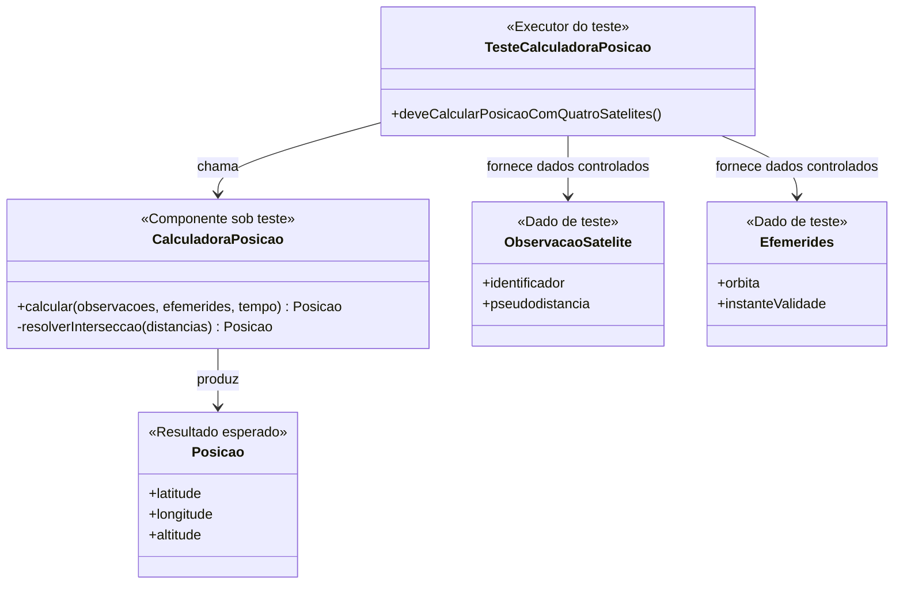

Fontes: [PlantUML](diagramas/plantuml/01-01-teste-unidade.puml) · [Mermaid](diagramas/mermaid/01-01-teste-unidade.mmd)

## 2. Teste de Integração

### 2.1 Integração Não Incremental — Big Bang

**Explicação:** todos os componentes principais são conectados de uma vez: recepção, validação, processamento, sincronização, efemérides, repositório e cálculo. O fluxo começa na aplicação, enquanto os satélites apenas transmitem os sinais.

**Objetivo do teste:** verificar se a arquitetura integrada consegue transformar sinais de navegação em uma posição apresentada ao usuário.

**Defeitos que busca revelar:** incompatibilidades de interfaces, formatos divergentes de observação, dependências não configuradas e falhas de comunicação entre módulos. A localização do defeito pode ser difícil porque muitas integrações são ativadas simultaneamente.

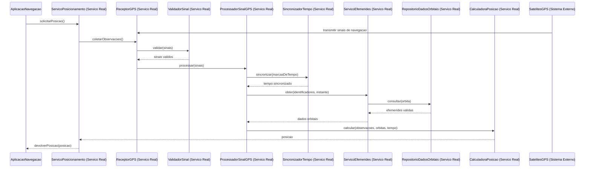

Fontes: [PlantUML](diagramas/plantuml/02-01-big-bang.puml) · [Mermaid](diagramas/mermaid/02-01-big-bang.mmd)

### 2.2 Integração Incremental Top-Down com Stubs

**Explicação:** `ServicoPosicionamento` é o componente superior real sob teste. Como os módulos inferiores ainda não estão disponíveis, `ReceptorGPSStub`, `ServicoEfemeridesStub` e `CalculadoraPosicaoStub` retornam respostas controladas. O Stub substitui o componente chamado; não há Driver nesse cenário.

**Objetivo do teste:** validar cedo o fluxo de coordenação, contratos e tratamento de respostas do serviço de posicionamento.

**Defeitos que busca revelar:** chamada com parâmetros errados, fluxo de controle incorreto, tratamento inadequado de sinal inválido, contratos incompatíveis e falhas na montagem da resposta.

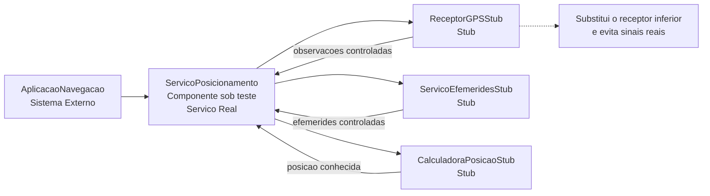

Fontes: [PlantUML](diagramas/plantuml/02-02-top-down-stubs.puml) · [Mermaid](diagramas/mermaid/02-02-top-down-stubs.mmd)

### 2.3 Integração Incremental Bottom-Up com Drivers

**Explicação:** os componentes inferiores reais — `ValidadorSinal`, `ProcessadorSinalGPS`, `SincronizadorTempo`, `ServicoEfemerides`, `RepositorioDadosOrbitais` e `CalculadoraPosicao` — são integrados antes de `ServicoPosicionamento`. `DriverTesteSinalGPS` fornece sinais e chama essa base para exercitá-la. O Driver não substitui um componente inferior.

**Objetivo do teste:** garantir que o pipeline de sinais, tempo, efemérides e cálculo troque dados corretamente antes da existência do controlador superior.

**Defeitos que busca revelar:** perda de metadados, unidade de tempo incompatível, consulta orbital incorreta, observações malformadas e parâmetros incompatíveis entre os componentes da base.

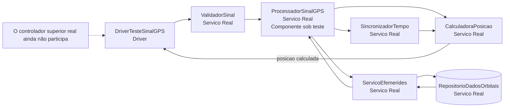

Fontes: [PlantUML](diagramas/plantuml/02-03-bottom-up-drivers.puml) · [Mermaid](diagramas/mermaid/02-03-bottom-up-drivers.mmd)

### 2.4 Teste de Fumaça — Smoke Testing

**Explicação:** `SmokeSuite` executa uma checagem curta após uma nova build: abrir a aplicação, solicitar uma posição, processar uma amostra gravada e exibir o resultado. É uma verificação de estabilidade mínima, não uma cobertura completa.

**Objetivo do teste:** decidir rapidamente se a build está apta a receber testes mais detalhados.

**Defeitos que busca revelar:** falha de inicialização, serviço indisponível, quebra do fluxo essencial, validação básica interrompida e impossibilidade de exibir uma posição.

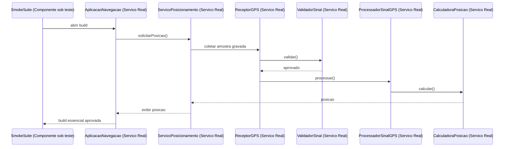

Fontes: [PlantUML](diagramas/plantuml/02-04-smoke-testing.puml) · [Mermaid](diagramas/mermaid/02-04-smoke-testing.mmd)

### 2.5 Teste de Regressão

**Explicação:** após uma alteração no `ServicoEfemerides`, a `SuiteRegressao` reexecuta o fluxo anteriormente aprovado, incluindo consulta ao repositório, cálculo e exibição na aplicação. O resultado é comparado ao baseline aprovado.

**Objetivo do teste:** confirmar que a mudança não quebrou funcionalidades que já funcionavam.

**Defeitos que busca revelar:** efeitos colaterais, mudança indevida de contrato, seleção errada de efemérides, cálculo alterado sem intenção e falhas no fluxo de posicionamento.

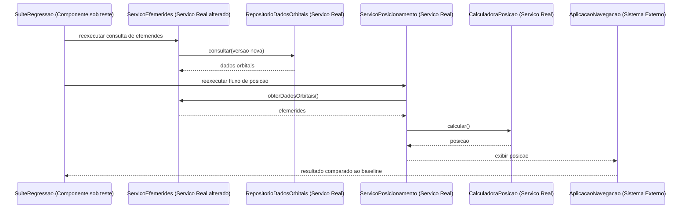

Fontes: [PlantUML](diagramas/plantuml/02-05-regressao.puml) · [Mermaid](diagramas/mermaid/02-05-regressao.mmd)

## 3. Teste de Validação

### 3.1 Critérios de Aceitação — UAT

**Explicação:** um usuário representante percorre o fluxo de solicitar sua posição e avalia se a aplicação apresenta latitude, longitude e um indicador de qualidade. Os critérios observam o comportamento percebido, não somente as chamadas internas.

**Objetivo do teste:** confirmar que o produto atende ao requisito de uso definido para a entrega.

**Critérios de aceitação do estudo:** com sinais válidos de múltiplos satélites, a aplicação deve exibir latitude e longitude e informar a qualidade do posicionamento. A posição só deve ser apresentada como confiável quando houver dados suficientes. Esses critérios são fictícios e adotados para o estudo de caso.

**Defeitos que busca revelar:** requisito não atendido, mensagem confusa, fluxo incompleto, posição exibida sem qualidade suficiente e comportamento diferente do esperado pelo usuário.

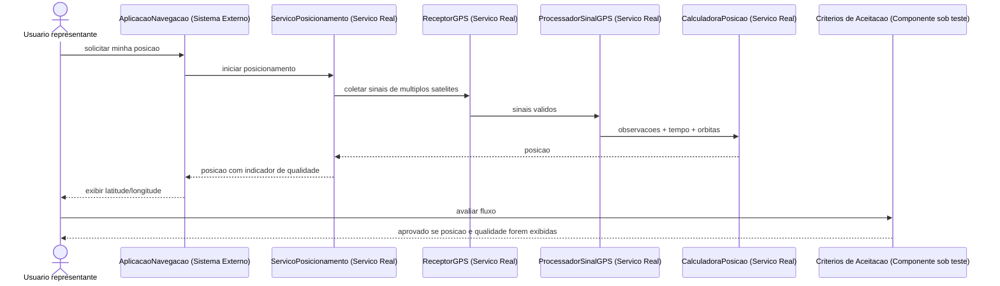

Fontes: [PlantUML](diagramas/plantuml/03-01-aceitacao.puml) · [Mermaid](diagramas/mermaid/03-01-aceitacao.mmd)

### 3.2 Teste Alfa — Alpha Testing

**Explicação:** a `VersaoAlfa` é usada pela equipe interna de QA em ambiente controlado. A constelação é representada por sinais gravados, e o `ColetorDiagnostico` registra logs e dificuldades durante cenários guiados.

**Objetivo do teste:** encontrar defeitos funcionais e de usabilidade antes da exposição externa ampla.

**Defeitos que busca revelar:** navegação confusa, mensagens incompletas, falhas de integração observáveis pela equipe e problemas que aparecem em uso exploratório controlado.

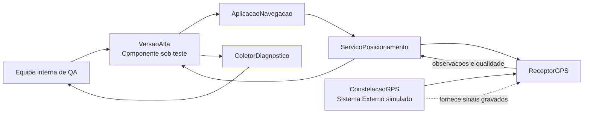

Fontes: [PlantUML](diagramas/plantuml/03-02-alpha-testing.puml) · [Mermaid](diagramas/mermaid/03-02-alpha-testing.mmd)

### 3.3 Teste Beta — Beta Testing

**Explicação:** um grupo piloto utiliza a `VersaoBeta` em redes, aparelhos e condições próximas das reais. `Telemetria` registra métricas anonimizadas e `Feedback` recebe relatos dos participantes.

**Objetivo do teste:** validar o comportamento do sistema fora do ambiente controlado da equipe de desenvolvimento.

**Defeitos que busca revelar:** incompatibilidades de dispositivos, instabilidade de recepção, falhas intermitentes, problemas de compreensão e condições ambientais não cobertas no Alfa.

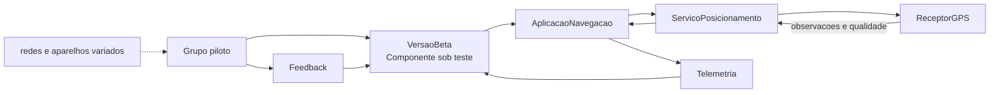

Fontes: [PlantUML](diagramas/plantuml/03-03-beta-testing.puml) · [Mermaid](diagramas/mermaid/03-03-beta-testing.mmd)

## 4. Teste de Sistema

### 4.1 Teste de Recuperação — Recovery Testing

**Explicação:** uma falha é injetada no `RepositorioDadosOrbitais` durante uma solicitação. `ServicoEfemerides` registra a falha, obtém a última cópia válida em `CacheEfemerides` e permite que o serviço conclua o posicionamento com um indicador degradado.

**Objetivo do teste:** verificar a recuperação diante da indisponibilidade do repositório e a continuidade controlada do fluxo.

**Defeitos que busca revelar:** ausência de contingência, falha não registrada, encerramento indevido da solicitação, uso de dados sem indicação de degradação e recuperação que não retorna ao fluxo.

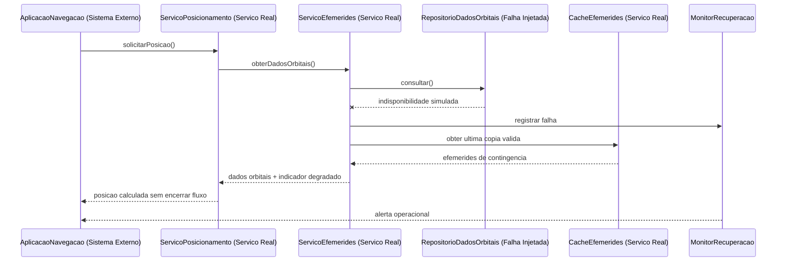

Fontes: [PlantUML](diagramas/plantuml/04-01-recuperacao.puml) · [Mermaid](diagramas/mermaid/04-01-recuperacao.mmd)

### 4.2 Teste de Segurança — Security Testing

**Explicação:** o controle de acesso protege atualizações de efemérides feitas pela `EstacaoControleTerrestre`. Uma tentativa sem permissão é bloqueada e auditada; uma credencial válida permite a atualização.

**Objetivo do teste:** verificar autenticação/autorização da operação sensível e a existência de rastreabilidade.

**Defeitos que busca revelar:** atualização sem autorização, ausência de auditoria, aceitação de dados adulterados, permissão excessiva e falta de separação entre operador autorizado e não autorizado.

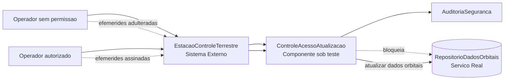

Fontes: [PlantUML](diagramas/plantuml/04-02-seguranca.puml) · [Mermaid](diagramas/mermaid/04-02-seguranca.mmd)

### 4.3 Teste de Estresse — Stress Testing

**Explicação:** `GeradorCarga` ultrapassa deliberadamente a capacidade planejada com 10.000 solicitações simultâneas, valor fictício adotado para este estudo. O teste observa `LimitadorFila`, recursos e comportamento de degradação.

**Objetivo do teste:** descobrir o limite operacional e verificar se o sistema degrada de maneira controlada quando submetido a uma carga anormal.

**Defeitos que busca revelar:** queda total, esgotamento de memória ou conexões, filas sem limite, ausência de rejeição controlada, crescimento desordenado de erros e degradação sem observabilidade.

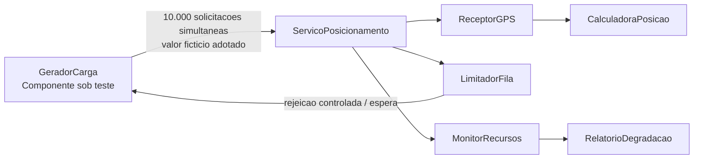

Fontes: [PlantUML](diagramas/plantuml/04-03-estresse.puml) · [Mermaid](diagramas/mermaid/04-03-estresse.mmd)

### 4.4 Teste de Desempenho — Performance Testing

**Explicação:** `GeradorCenarios` executa uma carga planejada e representativa com sinais gravados e efemérides em cache. `ColetorMetricas` registra latência, vazão e uso de recursos.

**Objetivo do teste:** medir o comportamento sob carga esperada e comparar os resultados com uma meta definida para o estudo.

**Meta do estudo:** 95% das respostas em até 2 segundos; esse valor é fictício e adotado exclusivamente para este estudo de caso, não uma especificação oficial do GPS.

**Defeitos que busca revelar:** gargalos de processamento, consulta lenta, baixa vazão, uso excessivo de CPU ou memória e descumprimento da meta de resposta.

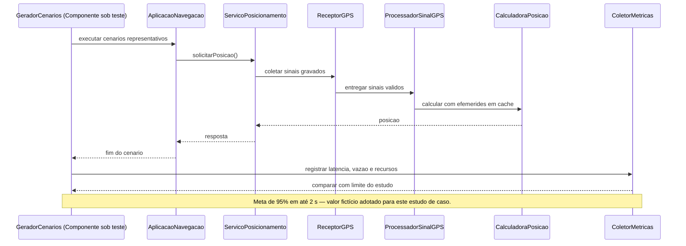

Fontes: [PlantUML](diagramas/plantuml/04-04-desempenho.puml) · [Mermaid](diagramas/mermaid/04-04-desempenho.mmd)

## Conclusão

As 13 abordagens foram aplicadas sobre uma única arquitetura GPS conceitual. O teste de unidade isola uma regra da calculadora; a integração mostra Big Bang, Top-Down com Stub, Bottom-Up com Driver, Smoke e Regressão; a validação aproxima o sistema do usuário por UAT, Alfa e Beta; e os testes de sistema verificam recuperação, segurança, estresse e desempenho. A separação entre Smoke e Regressão, Alfa e Beta, Estresse e Desempenho foi mantida conforme o objetivo de cada abordagem.

## Organização dos diagramas

Os arquivos `.puml` são os fontes PlantUML e os `.mmd` são versões Mermaid equivalentes, com o mesmo cenário e os mesmos papéis. A pasta `png/` foi reservada para imagens renderizadas caso uma ferramenta compatível esteja disponível.
